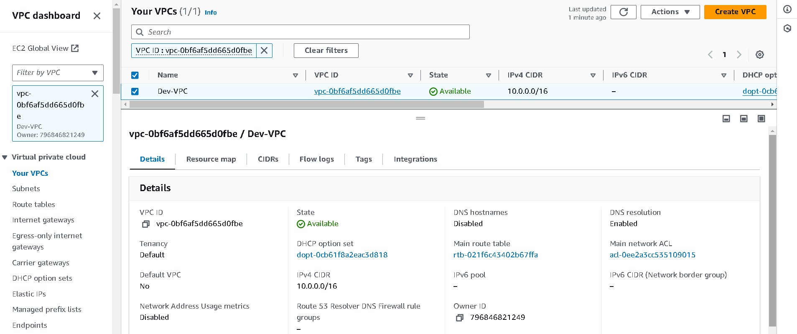
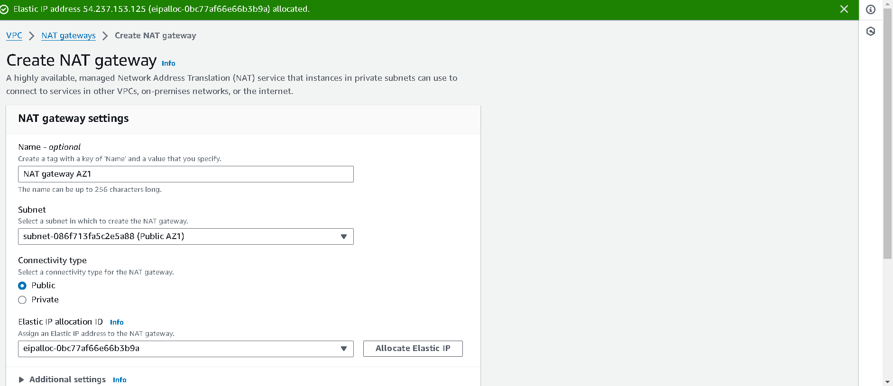
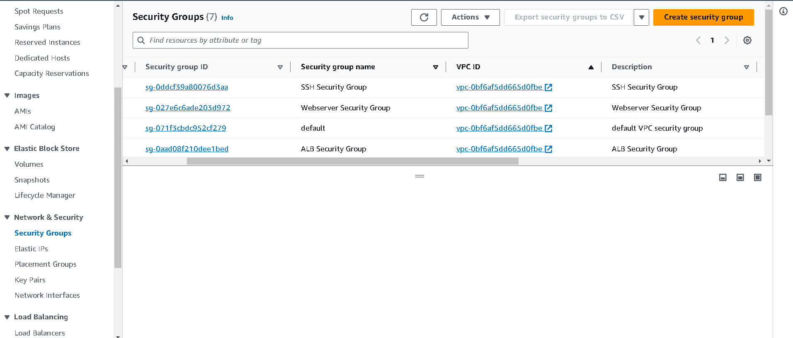
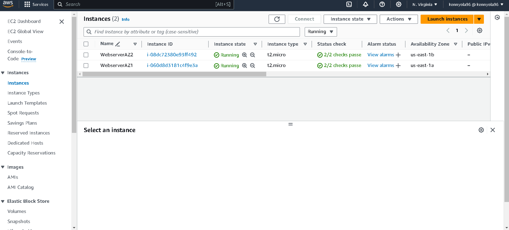
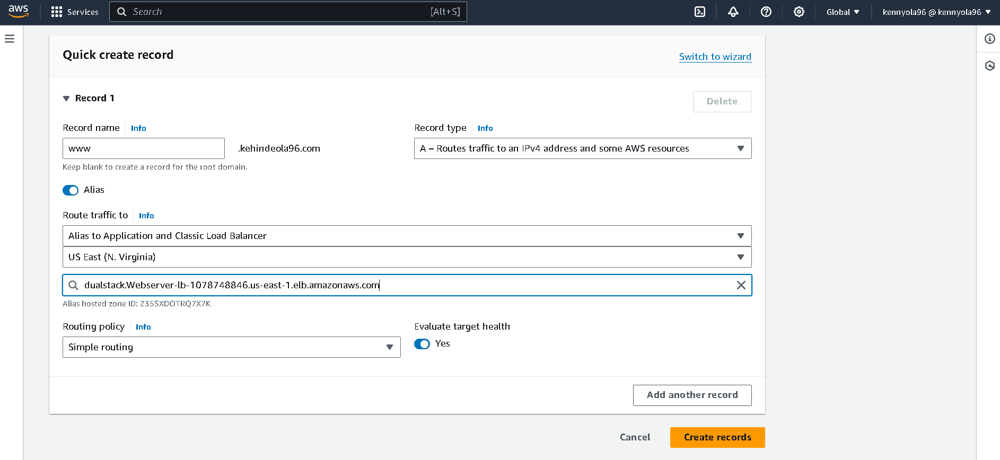
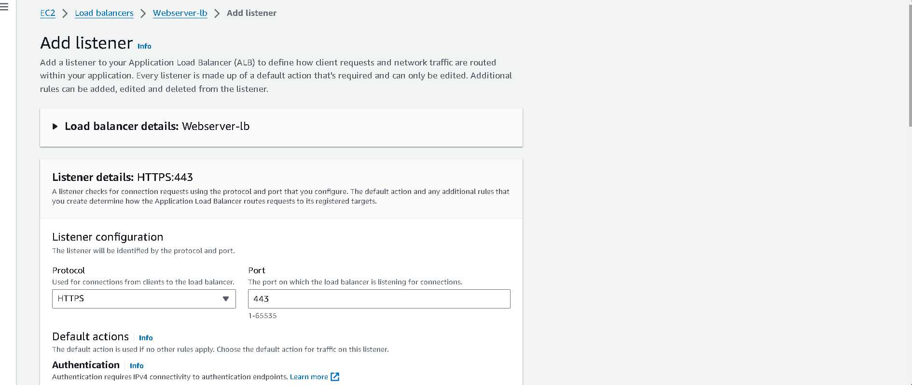
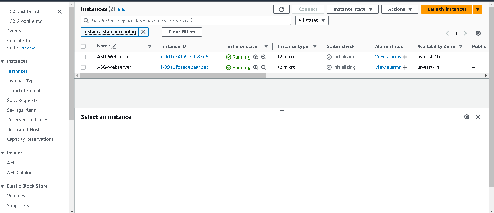

# Static-website on AWS

## Overview
This project involves deploying a static website on AWS using a custom VPC with a highly scalable, elastic, and secure infrastructure. The setup includes an Application Load Balancer, EC2 instances, Route 53 for domain management, SSL certificates for secure communication, and an Auto Scaling Group to ensure high availability and fault tolerance.

## Architecture Diagram

## Project Steps

1. **Create a Two-Tier AWS Network VPC**
    - Provisioned a custom VPC with public and private subnets across multiple availability zones (AZs) for high availability and fault tolerance.
    - Configured route tables and associated them with the subnets to manage traffic routing.

2. **Create NAT Gateways**
    - Deployed NAT Gateways in the public subnets to allow instances in the private subnets to access the internet.
    - Configured the private route table to route traffic to the internet through the NAT Gateway.

3. **Create Security Groups**
    - **ALB Security Group**:
      - Ports: 80 and 443
      - Source: 0.0.0.0/0
    - **SSH Security Group**:
      - Port: 22
      - Source: Your IP Address
    - **Webserver Security Group**:
      - Ports: 80 and 443
      - Source: ALB Security Group
      - Port: 22
      - Source: SSH Security Group

### Application Deployment

4. **Create an Application Load Balancer**
    - Deployed an Application Load Balancer to distribute web traffic across EC2 instances in multiple availability zones.
    - Configured the load balancer to balance traffic and improve the availability of the web application

5. **Register a New Domain Name in Route 53**
    - Registered a new domain name using AWS Route 53 to manage DNS settings for the website.

6. **Create a Record Set in Route 53**
    - Created a Record Set in Route 53 to map the domain name to the Application Load Balancer.

7. **Register for an SSL Certificate in AWS Certificate Manager**
    - Obtained an SSL certificate from AWS Certificate Manager to secure the website with HTTPS.

8. **Create an HTTPS (SSL) Listener for the Application Load Balancer**
    - Configured an HTTPS listener on the Application Load Balancer to use the SSL certificate for secure communication.

9. **Create an Auto Scaling Group**
    - Set up an Auto Scaling Group to dynamically create EC2 instances based on traffic load, ensuring high availability, scalability, fault tolerance, and elasticity.

## Prerequisites
- AWS Account
- Domain Name

## Steps to Deploy

### Create a  AWS Network VPC

###  Create NAT Gateways

### Create Security Groups

### Create an Application Load Balancer
  Deployed an Application Load Balancer to distribute web traffic across EC2 instances in multiple availability zones.
  Configured the load balancer to balance traffic and improve the availability of the web application

### Register a New Domain Name in Route 53
Navigate to Route 53 in the AWS Management Console and register a new domain name.

### Create a Record Set in Route 53
Created a Record Set in Route 53 to map the domain name to the Application Load Balancer.

Create a Record Set in Route 53

### Register for an SSL Certificate in AWS Certificate Manager
Obtained an SSL certificate from AWS Certificate Manager to secure the website with HTTPS.

### Create an HTTPS (SSL) Listener for the Application Load Balancer
Configured an HTTPS listener on the Application Load Balancer to use the SSL certificate for secure communication.

### Create an Auto Scaling Group
Set up an Auto Scaling Group to dynamically create EC2 instances based on traffic load, ensuring high availability, scalability, fault tolerance, and elasticity.

### Secured Website 

